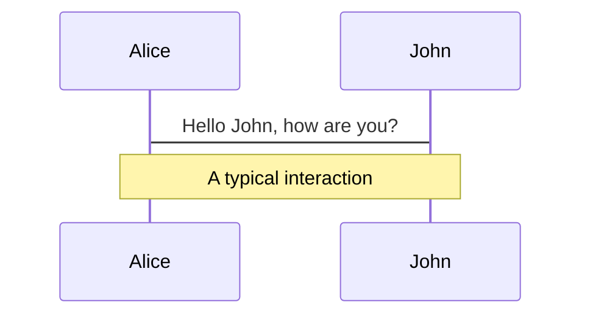
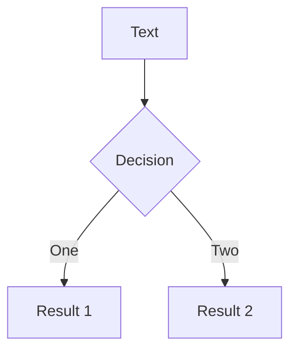
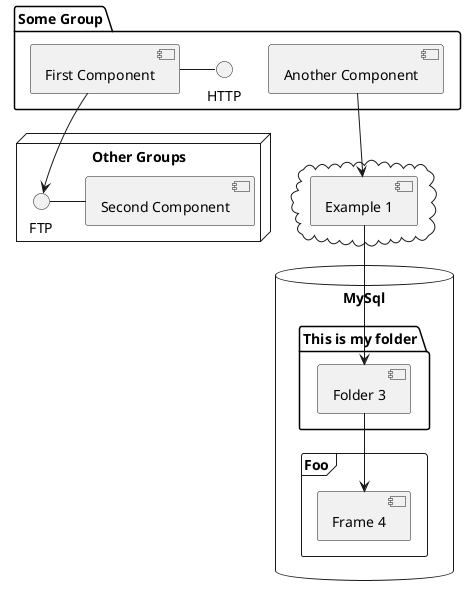

---
# try also 'default' to start simple
theme: seriph
# random image from a curated Unsplash collection by Anthony
# like them? see https://unsplash.com/collections/94734566/slidev
background: https://source.unsplash.com/collection/94734566/1920x1080
# apply any windi css classes to the current slide
class: 'text-center'
# https://sli.dev/custom/highlighters.html
highlighter: shiki
# show line numbers in code blocks
lineNumbers: false
# some information about the slides, markdown enabled
info: |
  ## Slidev Starter Template
  Presentation slides for developers.

  Learn more at [Sli.dev](https://sli.dev)
# persist drawings in exports and build
drawings:
  persist: false
---

# 2组报告

理论力学动力学普遍定理综合应用


<!--
The last comment block of each slide will be treated as slide notes. It will be visible and editable in Presenter Mode along with the slide. [Read more in the docs](https://sli.dev/guide/syntax.html#notes)
-->

---

# 题目

第二个题


<br>
<br>


<!--
You can have `style` tag in markdown to override the style for the current page.
Learn more: https://sli.dev/guide/syntax#embedded-styles
-->

<style>
h1 {
  background-color: #2B90B6;
  background-image: linear-gradient(45deg, #4EC5D4 10%, #146b8c 20%);
  background-size: 100%;
  -webkit-background-clip: text;
  -moz-background-clip: text;
  -webkit-text-fill-color: transparent;
  -moz-text-fill-color: transparent;
}
</style>

---

# 能量解法

第一种

$$
mg\sin30-mgfs\cos30-m_cg\frac{s}{4}+M\frac{s}{2r}=\frac{1}{2}m_AV_A^2+\frac{1}{2}m_BV_C^2+\frac{1}{2}J_0\omega^2+\frac{1}{2}J_C\omega_C^2
$$

辅助方程：


$$

\begin{array}{c}

  T_0=m\rho^2 & \\
  J_C=\frac{1}{6}mr^2 & \\
  \omega_c=\frac{v}{r} & \\
  \omega=\frac{2v}{r} & \\
  v_A=4v


\end{array}


$$

可得最后结果

速度：

$$
v=\sqrt(\frac{248-96\sqrt(3)f}{102+24\frac{\rho^2}{r^2}}gs)
$$

---
layout: default
---

# 达朗贝尔方法：

第二种

整体对O点力矩平衡：
$$
-(Fs+ma_1-\frac{1}{2}mg)\cdot 2r+M-M_{I_1}+M_{I_2}+T_3\cdot 3r-(\frac{m}{3}g+\frac{m}{3}a_2+\frac{m}{2}g+\frac{m}{2}a_2)\cdot 2r=0
$$

对整体y方向受力平衡：

$$
(Fs+ma_1-\frac{1}{2}mg)\sin30+F_Dy+T_3-(\frac{m}{3}g+\frac{m}{3}a_2+\frac{m}{2}g+\frac{m}{2}a_2)=0
$$

其中

$$
F_S=\frac{\sqrt(3)}{2}mgf\ (对物块A受力分析) \\
M_{I_1}=J_0\alpha_1=m\rho^2\alpha_1=m\rho^2\frac{a_1}{2r} \\
M_{I_2}=J_C\alpha_2=\frac{1}{2}(\frac{1}{3}mr^2)\alpha_2=\frac{1}{6}mr^2\cdot \frac{a_1}{4r}=\frac{mr}{24}a_1 \\
a_2=\frac{a_1}{4}
$$


---

可解得$T_3$, $a_1$的关系：

$$
(\frac{4}{3}-\sqrt(3)f)mg-(\frac{19}{8}+\frac{\rho^2}{2r^2})\cdot ma_1+3\sqrt(3)+0
$$

再对滑轮重物(C和B)在D点列力矩平衡：

$$
-(\frac{m}{3}g+\frac{m}{3}a_2+\frac{m}{2}g+\frac{m}{2}a_2)r+MI_2+T_3\cdot 2r=0
$$


---
class: px-20
---

# Themes

Slidev comes with powerful theming support. Themes can provide styles, layouts, components, or even configurations for tools. Switching between themes by just **one edit** in your frontmatter:

<div grid="~ cols-2 gap-2" m="-t-2">

```yaml
---
theme: default
---
```

```yaml
---
theme: seriph
---
```


</div>

Read more about [How to use a theme](https://sli.dev/themes/use.html) and
check out the [Awesome Themes Gallery](https://sli.dev/themes/gallery.html).

---
preload: false
---

# Animations

Animations are powered by [@vueuse/motion](https://motion.vueuse.org/).

```html
<div
  v-motion
  :initial="{ x: -80 }"
  :enter="{ x: 0 }">
  Slidev
</div>
```

<div class="w-60 relative mt-6">
  <div class="relative w-40 h-40">
    
    
    
  </div>

  <div
    class="text-5xl absolute top-14 left-40 text-[#2B90B6] -z-1"
    v-motion
    :initial="{ x: -80, opacity: 0}"
    :enter="{ x: 0, opacity: 1, transition: { delay: 2000, duration: 1000 } }">
    Slidev
  </div>
</div>

<!-- vue script setup scripts can be directly used in markdown, and will only affects current page -->
<script setup lang="ts">
const final = {
  x: 0,
  y: 0,
  rotate: 0,
  scale: 1,
  transition: {
    type: 'spring',
    damping: 10,
    stiffness: 20,
    mass: 2
  }
}
</script>

<div
  v-motion
  :initial="{ x:35, y: 40, opacity: 0}"
  :enter="{ y: 0, opacity: 1, transition: { delay: 3500 } }">

[Learn More](https://sli.dev/guide/animations.html#motion)

</div>

---

# LaTeX

LaTeX is supported out-of-box powered by [KaTeX](https://katex.org/).

<br>

Inline $\sqrt{3x-1}+(1+x)^2$

Block
$$
\begin{array}{c}

\nabla \times \vec{\mathbf{B}} -\, \frac1c\, \frac{\partial\vec{\mathbf{E}}}{\partial t} &
= \frac{4\pi}{c}\vec{\mathbf{j}}    \nabla \cdot \vec{\mathbf{E}} & = 4 \pi \rho \\

\nabla \times \vec{\mathbf{E}}\, +\, \frac1c\, \frac{\partial\vec{\mathbf{B}}}{\partial t} & = \vec{\mathbf{0}} \\

\nabla \cdot \vec{\mathbf{B}} & = 0

\end{array}
$$

<br>

[Learn more](https://sli.dev/guide/syntax#latex)

---

# Diagrams

You can create diagrams / graphs from textual descriptions, directly in your Markdown.

<div class="grid grid-cols-3 gap-10 pt-4 -mb-6">







</div>

[Learn More](https://sli.dev/guide/syntax.html#diagrams)


---
layout: center
class: text-center
---

# Learn More

[Documentations](https://sli.dev) · [GitHub](https://github.com/slidevjs/slidev) · [Showcases](https://sli.dev/showcases.html)
